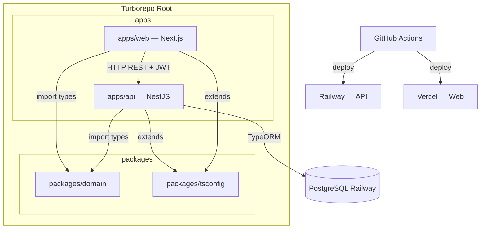

# Monorepo Boilerplate Design

**Spec:** `.specs/features/monorepo-boilerplate/spec.md`
**Status:** Draft

---

## Architecture Overview



---

## Monorepo Structure

```
/
├── apps/
│   ├── api/                    ← NestJS (renomeado de manager-api)
│   └── web/                    ← Next.js 15 (novo, substitui manager-front)
├── packages/
│   ├── domain/                 ← tipos e interfaces compartilhadas
│   └── tsconfig/               ← tsconfig base
├── .github/
│   └── workflows/
│       ├── ci.yml
│       ├── deploy-api.yml
│       └── deploy-web.yml
├── turbo.json
└── package.json                ← root (workspaces)
```

---

## packages/domain — Design

**Purpose:** Tipos compartilhados entre api e web. Sem dependências externas (sem React, sem NestJS).

```typescript
// packages/domain/src/entities/user.entity.ts
export interface User {
  id: string
  name: string
  email: string
  createdAt: Date
  updatedAt: Date
}

// packages/domain/src/entities/service.entity.ts
export interface Service {
  id: string
  cliente: Cliente
  tipo: TipoServico
  status: StatusServico
  // ... (preserva campos existentes de servico.entity.ts)
  createdAt: Date
  updatedAt: Date
}
```

**Exports:** `@manager/domain` — entities, enums, value objects

---

## Backend (apps/api) — Clean Architecture

### Estrutura de Camadas

```
src/
├── domain/                        ← puro TypeScript, zero NestJS
│   ├── entities/
│   │   ├── user.entity.ts         ← classe com lógica de domínio (ex: hashPassword)
│   │   └── service.entity.ts      ← migrado de servicos/entities/
│   ├── repositories/
│   │   ├── user.repository.ts     ← interface IUserRepository
│   │   └── service.repository.ts  ← interface IServiceRepository
│   └── exceptions/
│       └── domain.exception.ts    ← DomainException base
│
├── application/
│   ├── use-cases/
│   │   ├── user/
│   │   │   ├── create-user.use-case.ts
│   │   │   ├── update-user.use-case.ts
│   │   │   ├── delete-user.use-case.ts
│   │   │   └── get-user.use-case.ts
│   │   └── service/
│   │       ├── create-service.use-case.ts
│   │       ├── update-service.use-case.ts
│   │       ├── delete-service.use-case.ts
│   │       └── get-service.use-case.ts
│   └── ports/
│       └── auth.port.ts           ← interface IAuthPort (generateToken, validateToken)
│
├── infrastructure/
│   ├── database/
│   │   └── typeorm/
│   │       ├── entities/
│   │       │   ├── user.orm-entity.ts     ← @Entity() com decorators TypeORM
│   │       │   └── service.orm-entity.ts
│   │       ├── repositories/
│   │       │   ├── user.typeorm-repository.ts   ← implementa IUserRepository
│   │       │   └── service.typeorm-repository.ts
│   │       └── migrations/
│   │           └── [timestamp]-initial.ts
│   └── modules/
│       ├── user/
│       │   ├── user.module.ts     ← registra token USER_REPOSITORY
│       │   ├── user.controller.ts
│       │   └── user.dto.ts
│       ├── service/
│       │   ├── service.module.ts
│       │   ├── service.controller.ts
│       │   └── service.dto.ts
│       └── auth/
│           ├── auth.module.ts
│           ├── auth.controller.ts  ← POST /auth/login, POST /auth/register
│           ├── auth.service.ts     ← implementa IAuthPort
│           ├── jwt.strategy.ts     ← passport-jwt strategy
│           └── auth.guard.ts       ← JwtAuthGuard
│
└── app.module.ts
```

### Injeção de Dependência — Tokens Simbólicos

```typescript
// Tokens para o container NestJS
export const USER_REPOSITORY = Symbol('USER_REPOSITORY')
export const SERVICE_REPOSITORY = Symbol('SERVICE_REPOSITORY')
export const AUTH_PORT = Symbol('AUTH_PORT')

// No UserModule:
providers: [
  { provide: USER_REPOSITORY, useClass: UserTypeOrmRepository },
  CreateUserUseCase,
  GetUserUseCase,
  // ...
]
```

### Entidade de Domínio (exemplo)

```typescript
// domain/entities/user.entity.ts — sem decorators NestJS/TypeORM
export class User {
  constructor(
    public readonly id: string,
    public name: string,
    public readonly email: string,
    public passwordHash: string,
    public readonly createdAt: Date,
    public updatedAt: Date,
  ) {}

  updateProfile(name: string): void {
    this.name = name
    this.updatedAt = new Date()
  }
}
```

### ORM Entity (exemplo)

```typescript
// infrastructure/database/typeorm/entities/user.orm-entity.ts
@Entity('users')
export class UserOrmEntity {
  @PrimaryGeneratedColumn('uuid') id: string
  @Column() name: string
  @Column({ unique: true }) email: string
  @Column() passwordHash: string
  @CreateDateColumn() createdAt: Date
  @UpdateDateColumn() updatedAt: Date
}
```

### Use Case (exemplo)

```typescript
// application/use-cases/user/create-user.use-case.ts
export class CreateUserUseCase {
  constructor(
    @Inject(USER_REPOSITORY) private readonly userRepo: IUserRepository,
    @Inject(AUTH_PORT) private readonly authPort: IAuthPort,
  ) {}

  async execute(dto: CreateUserDto): Promise<{ user: User; token: string }> {
    const existing = await this.userRepo.findByEmail(dto.email)
    if (existing) throw new ConflictException('Email already in use')

    const passwordHash = await this.authPort.hashPassword(dto.password)
    const user = new User(uuid(), dto.name, dto.email, passwordHash, new Date(), new Date())
    await this.userRepo.save(user)
    return user
  }
}
```

### Data Models

**PostgreSQL — tabela users**
```sql
users (
  id          UUID PRIMARY KEY DEFAULT gen_random_uuid(),
  name        VARCHAR(255) NOT NULL,
  email       VARCHAR(255) UNIQUE NOT NULL,
  password_hash VARCHAR(255) NOT NULL,
  created_at  TIMESTAMP DEFAULT NOW(),
  updated_at  TIMESTAMP DEFAULT NOW()
)
```

**PostgreSQL — tabela services**
```sql
services (
  id              UUID PRIMARY KEY DEFAULT gen_random_uuid(),
  cliente_id      VARCHAR(255),
  cliente_nome    VARCHAR(255),
  cliente_email   VARCHAR(255),
  tipo            VARCHAR(50),
  status          VARCHAR(50),
  data_inicio     DATE,
  data_fim        DATE,
  valor_total     DECIMAL(10,2),
  forma_pagamento VARCHAR(50),
  created_at      TIMESTAMP DEFAULT NOW(),
  updated_at      TIMESTAMP DEFAULT NOW()
)
```

> Nota: campos aninhados complexos (cronograma, pagamentos, documentos) serão armazenados como JSONB ou tabelas separadas — decisão a tomar na implementação da migration.

---

## Frontend (apps/web) — Clean Architecture

### Estrutura de Camadas

```
src/
├── domain/
│   ├── entities/
│   │   ├── user.entity.ts         ← re-exporta ou estende @manager/domain
│   │   └── service.entity.ts
│   ├── repositories/
│   │   ├── user.repository.ts     ← interface IUserRepository
│   │   └── service.repository.ts
│   └── value-objects/
│       └── email.vo.ts            ← Email com validação
│
├── application/
│   ├── use-cases/
│   │   ├── user/
│   │   │   ├── create-user.use-case.ts
│   │   │   ├── get-users.use-case.ts
│   │   │   └── delete-user.use-case.ts
│   │   └── auth/
│   │       ├── login.use-case.ts
│   │       └── logout.use-case.ts
│   └── ports/
│       └── auth-token.port.ts     ← interface IAuthTokenPort (getToken, setToken, clear)
│
├── infrastructure/
│   ├── http/
│   │   ├── user.http-repository.ts   ← implementa IUserRepository via axios
│   │   ├── service.http-repository.ts
│   │   └── auth.http-repository.ts
│   ├── storage/
│   │   └── local-storage-token.ts    ← implementa IAuthTokenPort
│   └── di/
│       └── container.ts              ← monta as injeções (factory functions)
│
└── presentation/
    ├── components/
    │   ├── ui/                        ← Button, Input, Modal, Select (migrados)
    │   └── shared/                    ← Layout, ServiceTable, ServiceForm, etc.
    ├── app/                           ← Next.js App Router
    │   ├── (auth)/
    │   │   ├── login/page.tsx
    │   │   └── register/page.tsx
    │   ├── (dashboard)/
    │   │   ├── layout.tsx             ← layout autenticado com redirect guard
    │   │   ├── page.tsx               ← Dashboard
    │   │   ├── services/page.tsx
    │   │   └── users/page.tsx
    │   └── layout.tsx                 ← root layout
    ├── hooks/
    │   ├── useCreateUser.ts           ← cola LoginUseCase → componente
    │   ├── useLogin.ts
    │   └── useServices.ts
    └── contexts/
        └── auth.context.tsx
```

### DI Container (Frontend)

```typescript
// infrastructure/di/container.ts
const tokenStorage = new LocalStorageToken()
const userRepo = new UserHttpRepository(tokenStorage)
const serviceRepo = new ServiceHttpRepository(tokenStorage)

export const loginUseCase = new LoginUseCase(userRepo, tokenStorage)
export const getUsersUseCase = new GetUsersUseCase(userRepo)
// ...
```

### Route Guard (Next.js App Router)

```typescript
// presentation/app/(dashboard)/layout.tsx
export default function DashboardLayout({ children }) {
  // Verificação do token via middleware.ts ou client-side redirect
  // middleware.ts na raiz do app cuida do redirect server-side
}
```

---

## CI/CD — GitHub Actions

### `.github/workflows/ci.yml`
- Trigger: push/PR em qualquer branch
- Jobs: lint, type-check, build (paralelos por app)

### `.github/workflows/deploy-api.yml`
- Trigger: push em `main`
- Jobs: build → deploy Railway → run migrations

### `.github/workflows/deploy-web.yml`
- Trigger: push em `main`
- Jobs: build → deploy Vercel (via `vercel --prod`)

---

## Code Reuse Analysis

### Componentes existentes para migrar

| Componente                           | Origem                              | Destino                                  |
|--------------------------------------|-------------------------------------|------------------------------------------|
| ServiceTable, ServiceForm, Filters   | `manager-front/src/components/`     | `apps/web/src/presentation/components/shared/` |
| Button, Input, Modal, Select         | `manager-front/src/components/ui/`  | `apps/web/src/presentation/components/ui/` |
| Servico entity + enums               | `manager-api/src/servicos/entities/`| `apps/api/src/domain/entities/` + `packages/domain/` |
| ServicosController (endpoints HTTP)  | `manager-api/src/servicos/`         | `apps/api/src/infrastructure/modules/service/` |

### O que é reescrito

| O que                   | Por quê                                             |
|-------------------------|-----------------------------------------------------|
| ServicosRepository      | DynamoDB → TypeORM PostgreSQL                       |
| main.ts                 | Lambda handler → NestJS bootstrap padrão            |
| manager-front/           | Vite/React → Next.js App Router                    |
| Hooks (useServices)     | Lógica extraída para use cases, hooks viram "cola"  |
| services/api.ts         | Substituído por infrastructure/http repositories    |

---

## Error Handling Strategy

| Error Scenario                  | Backend Handling                       | Frontend Impact                  |
|---------------------------------|----------------------------------------|----------------------------------|
| Credenciais inválidas           | 401 UnauthorizedException              | Mensagem de erro no form         |
| Email duplicado (create user)   | 409 ConflictException                  | Mensagem "email já em uso"       |
| Resource não encontrado         | 404 NotFoundException                  | Toast de erro                    |
| Token inválido/expirado         | 401 (jwt strategy)                     | Redirect para /login             |
| Validação DTO falha             | 400 ValidationPipe com detalhes        | Erros no form                    |
| DB connection error             | 500 + log (não expõe detalhes)         | Mensagem genérica de erro        |

---

## Tech Decisions

| Decision                              | Choice                                 | Rationale                                                   |
|---------------------------------------|----------------------------------------|-------------------------------------------------------------|
| Monorepo tooling                      | Turborepo                              | Padrão para TS monorepos, cache de build, pipelines claras  |
| ORM                                   | TypeORM                                | Integração nativa NestJS, migrations, entities decoradas    |
| Auth library                          | @nestjs/jwt + @nestjs/passport         | Ecossistema padrão NestJS para JWT                          |
| Password hashing                      | bcryptjs                               | Sem dependências nativas, simples e seguro                  |
| Frontend framework                    | Next.js 15 App Router                  | SSR, roteamento por pasta, ecosystem React maduro           |
| Frontend HTTP client                  | Axios (mantido)                        | Já em uso, interceptors prontos                             |
| Frontend DI                           | Factory functions (sem container lib)  | Simples, sem overhead de lib de DI para o frontend          |
| Services sub-fields (cronograma etc.) | JSONB columns no PostgreSQL            | Preserva flexibilidade sem criar 6 tabelas extras           |
